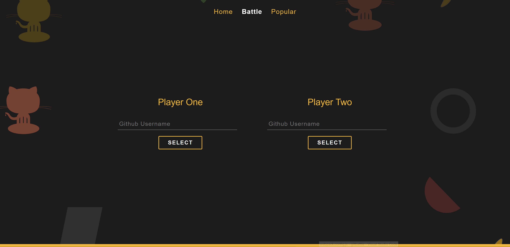

# GitHub Battle

This project was created as part of a React skills showcase. It displays competencies with npm, webpack, babel, elements, components, props, state, propTypes, defaultProps, stateless functional components, lifecycle events, asyncronous requests, dynamic rendering, query parameters, ES6, Promises, axios and the React Router.

This app allows us to:

- See the welcome page with its links.
- Compare two GitHub account's score. Basing on the numbers of followers and stars it declares the winner.
- See the most popular GitHub repos based on their languages.





## Getting Started

### Installation

```sh
npm install
```

### Development

```sh
npm start
# this will start the webpack development server
# then the page http://localhost:8080 will be opened
```

### Deployment

```sh
npm run firebase-init
npm run deploy
```
